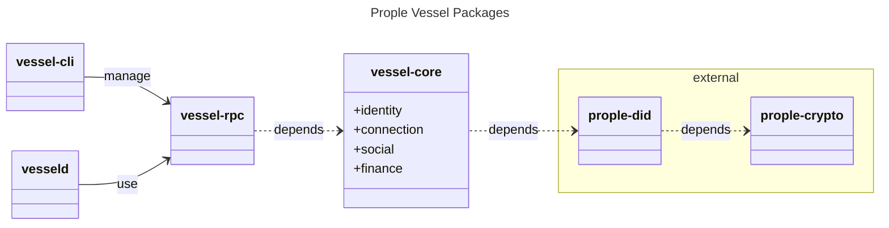

|   Paper   |   Section |   Version |   Author  |   CreatedAt   |
|   ------- |   ------- |   ------  |   ------  |   ---------   |
|   [The Prople Paper](https://github.com/prople/paper/tree/main/the-prople-paper/v1.0.0)   |   `Architecture` | v1.0.0 | [rstlix0x0](https://github.com/rstlix0x0/) |    July, 23th, 2024  01:15 UTC

---

# Architecture

## Components

### Vessel: Personal Self Sovereign Agent & Wallet

`Prople Vessel` is a software which like a *container* that deployed in some server's environments, it can be a cloud or bare metal environment, or even deployed in *localhost* and use some tools, maybe like *ngrok* to make it reachable through the Internet.

> A `Vessel` should be able to deployed in any environments which able to reached through the Internet. It should not be like a *blockchain node* or *validator* that need a high level computation or expensive resource computation.

The `Vessel Daemon` that need to be deployed and run, will open a single port used to maintain `HTTP JSON-RPC API`. The `API` itself will have a functionalities to maintain:

- `Identity`
- `Connection`
- `Social`
- `Finance`

It choose the `JSON-RPC` as main protocol communication becaus its simplicty, no need to maintain multiple endpoints and its handlers, just a single enpdpoint that able to receive multiple commands.

#### Packages 

The `Vessel` codebase separated into multiple `Rust Packages`:



Internal packages:

- `vessel-core`: It's a core domain abstractions which provides all domain logics
- `vessel-rpc` : It's an RPC handlers and also persistent storage
- `vessel-cli` : It's a command-line utility used to communicate with the *actor vessel*
- `vesseld` : It's a *vessel daemon* or binary application that will be deployed and executed in some environments 

External packages:

- `prople/did` : It's a package build to modeling the `DID`
- `prople/crypto` : It's a package used to manage cryptography algorithms 

#### Cryptography

There are two important needs for the *cryptography* :

- Key exchanges
- Digital signatures

The cryptography at the `prople/crypto` designed specifically only for `Prople Ecosystem`. There are multiple algorithms used:

- `ECDH`: Used to generate *keypairs* (public and private keys), to establish a *shared secret key*
- `EdDSA`: It's a digital signature scheme, which will be used as the *unique identifier*
- `Blake3`: Used for a *hash function*
- `Chacha20-Poly1305`: It's a `AEAD (Authenticated Encryption with Additional Data)` algorithm
- `Base58`: Used for encoding format

All of these algorithms will be used heavily in the `prople/did`, such as when generate the `DID`. The algorithm:

```
eddsa::KeyPair -> get publicKey -> hash: SHA3 -> hash: Blake3 -> multibase: Base58Btc 
```

---

> [The Prople Paper: Architecture](https://github.com/prople/paper/blob/main/the-prople-paper/v1.0.0/architecture.md) © 2024 by [rstlix0x0](https://github.com/rstlix0x0/) is licensed under [Creative Commons Attribution-ShareAlike 4.0 International](https://creativecommons.org/licenses/by-sa/4.0/?ref=chooser-v1) 
