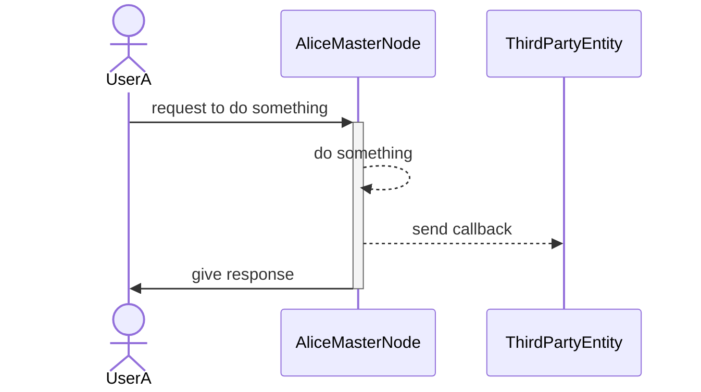

|   Paper   |   Section |   Version |   Author  |   CreatedAt   |
|   ------- |   ------- |   ------  |   ------  |   ---------   |
|   [The Prople Paper](https://github.com/prople/paper/tree/main/the-prople-paper/v1.0.0)   |   `Architecture` | v1.0.0 | [rstlix0x0](https://github.com/rstlix0x0/) |    July, 23th, 2024  01:15 UTC

# Table of Contents

- [Principles](https://github.com/prople/paper/blob/main/the-prople-paper/v1.0.0/architecture.md#principles)
- [Components](https://github.com/prople/paper/blob/main/the-prople-paper/v1.0.0/architecture.md#components)
    - [Vessel: Personal Self Sovereign Agent & Wallet](https://github.com/prople/paper/blob/main/the-prople-paper/v1.0.0/architecture.md#vessel-personal-self-sovereign-agent--wallet)
        - [Packages](https://github.com/prople/paper/blob/main/the-prople-paper/v1.0.0/architecture.md#packages)
        - [Cryptography](https://github.com/prople/paper/blob/main/the-prople-paper/v1.0.0/architecture.md#cryptography)
    - [VSP (Vessel Service Provider)](https://github.com/prople/paper/blob/main/the-prople-paper/v1.0.0/architecture.md#vsp-vessel-service-provider)
        - [Example Use Cases](https://github.com/prople/paper/blob/main/the-prople-paper/v1.0.0/architecture.md#example-use-cases)
    - [Vessel WebHooks](https://github.com/prople/paper/blob/main/the-prople-paper/v1.0.0/architecture.md#vessel-webhooks)

---

# Architecture

## Principles

- `ADAP (As Decentralized As Possible)`
- `ASAP (As Simple As Possible)`

`Prople` have a mission and vision to provides an open and decentralized network where anyone can be participated to join the network. It different with other *private network* which owned and maintained by a single entity like company.

Unlike current *blockchain networks* that *sometimes* it will require a high resources to run their nodes, `Prople` designed to be *as simple as possible*, because if it's getting easier to run a *node* by anyone, it means we have a high confident that our network will be decentralized enough, to make sure it always *as decentralized as possible*. 

## Components

### Vessel: Personal Self Sovereign Agent & Wallet

`Prople Vessel` is a software which like a *container* that deployed in some server's environments, it can be a cloud or bare metal environment, or even deployed in *localhost* and use some tools, maybe like *ngrok* to make it reachable through the Internet.

> A `Vessel` should be able to deployed to any environments which able to reached through the Internet. It should not be like a *blockchain node* or *validator* that need a high level computation or expensive resource computation.

The `Vessel Daemon` that need to be deployed and run, will open a single port used to maintain `HTTP JSON-RPC API`. The `API` itself will have a functionalities to maintain:

- `Identity`
- `Connection`
- `Social`
- `Finance`

It choose the `JSON-RPC` as main protocol communication becaus its simplicty, no need to maintain multiple endpoints and its handlers, just a single enpdpoint that able to receive multiple commands.

> Each of an *actor* will may have multiple *vessels*, but a single *vessel* will only be owned by a single *actor*.


All communication between *actors* will have through their *vessels*, and the communication protocol used between *vessels* is via `JSON-RPC API`.


`Prople Vessel` designed to be deployed and run as a single instance. There is no need to make a *replica* of it, because its usages only for a personal activities, including its interaction with other *vessels*. The communication between *vessels* will always happened *one-to-one* not *many-to-one*. 

The analogy is, when we are building a *centralized entity*, there will be a lot of incoming connections and requests. This condition give us needs to make our system must be *scalable* enough to handle the incoming requests, this condition called as *many-to-one*. 

For the personal activities, it will be very rare to face those kind of condition. The communication between *vessels* should be happened through *one-to-one* connections. 

#### Packages 

The `Vessel` codebase separated into multiple `Rust Packages`:


Internal packages:

- `vessel-core`: It's a core domain abstractions which provides all domain logics
- `vessel-rpc` : It's an RPC handlers and also persistent storage
- `vessel-cli` : It's a command-line utility used to communicate with the *actor vessel*
- `vesseld` : It's a *vessel daemon* or binary application that will be deployed and executed in some environments 

External packages:

- `prople/did` : It's a package build to modeling the `DID`
- `prople/crypto` : It's a package used to manage cryptography algorithms 

#### Cryptography

There are two important needs for the *cryptography* :

- Key exchanges
- Digital signatures

The cryptography at the `prople/crypto` designed specifically only for `Prople Ecosystem`. There are multiple algorithms used:

- `ECDH`: Used to generate *keypairs* (public and private keys), to establish a *shared secret key*
- `EdDSA`: It's a digital signature scheme, which will be used as the *unique identifier*
- `Blake3`: Used for a *hash function*
- `Chacha20-Poly1305`: It's a `AEAD (Authenticated Encryption with Additional Data)` algorithm
- `Base58`: Used for encoding format

---

The *key exchanges* will be used to create a secure channel of communication between *actors*.

There are two kind of *connections* :

- Public connection
- Private connection

For an *actor* to be able to connected and share *private messages*, they have to be *connected*. This special connection, means they need to exchange their *ECDH public keys*. These keys will be used to generate the *shared secret key*, which is a combination between private keys and public keys from others. Once this *secret keys* generated, their next communication will be formed in the *encrypted messages*. [^1] 

This kind of algorithms used through the `DIDComm` standard.

> DIDComm uses DIDs (Decentralized Identifiers) to establish confidential, ongoing connections, without the need for usernames and passwords.
>
> DIDComm protocols enable trusted interactions between parties [^2][^3]

---

The `EdDSA` algorithm used for two cases:

- Message digital signatures
- Identity unique identifiers

The algorithm behind the *unique identifiers*:

```
eddsa::KeyPair -> get publicKey -> hash: SHA3 -> hash: Blake3 -> multibase: Base58Btc 
```

This algorithm actually follow what `Bitcoin` when generate the *address*, but using different hashing algorithms. 

|   Bitcoin |   Prople  |
|   ------- |   ------  |
|   `SHA256` & `RIPEMD` |   `SHA3` & `BLAKE3`   |

### VSP (Vessel Service Provider)

> `Prople` designed by a people for the people. The objective is building the personalization platform, and help each others 

The `Prople Vessel` is really a good fit to maintain a personal needs. But the disadvantages is, it need a technical skills to setup. An user need to deploy and execute the binary in their chosen environments, it will be an easy task for technical persons, but for the non-technical person it will be really hard. 

The `Prople` designed to be an *open and decentralized networks*, which means, anyone can participate to join and build the network. A technical users will able to participate and join the network by become the *service providers*, providing help to other non-technical users, as a `VSP (Vessel Service Provider)`.

The `VSP` will maintain `Prople Vessel` as a *logical views* to handle multi tenants. The difference with the single running daemon of *vessel* is if a single daemon running the engine in some environments, the *VSP* will run as a cluster engine used to maintain multiple *vessel abstractions*. This concept is more like a *database replication system*, where a software engineer setup their database which contain multiple nodes, and each of these nodes connected each others and replicate the data to all of available nodes. All the functionalities will be same like a single *vessel instance*.

For the highlevel overview of `VSP` will be like this:


Each of data will be replicated to other available nodes using the `Raft Procotol` as a base protocol standard to replicate the data including for *master/leader election*. Any user requests will always comes through the *master node*.

> The internal communication between nodes including for its *master/leader* will using *libp2p network stacks* to maintain peer-to-peer network communications
>
> This *libp2p* will also be used for the *master-to-master* communication protocol between *providers*

#### Example use cases

Each of *providers* may be connected to each others. Let's say there are two *service providers*, `Alice` and `Bob`. Both of them as a *provider*, already setup their *vsp networks*.

Alice networks:


Bob networks:


They may have to connected each others:


If there are third party involved, let's say, `Tom`, the network diagram will be like this:


The communication protocol between *master nodes* will be formed through the `JSON-RPC API`. It will have additional API methods compared with the `Prople Vessel` single instance.

Unlike *blockchain node operator*, the primary data submitted by user will be saved only in a single *provider*. For an example, an *UserA* submit their identities through the `Alice Provider`. The *UserA* data will be saved only at the `Alice Provider`, and will only be replicated inside the `Alice VSP Nodes`, the *primary data* will not be shared with other connected *provider master nodes*.

The reason of this approach is to make sure that once an user decide to remove their personal data *forever*, they only need to remove it from a single *node*, other nodes that asking the value will be affected. It's different concept with the *blockchain node* where the data will always saved in the *immutable database*.

> To make sure that an user has a true ownership and control for their data, especially for their identities, they have full rights to modify and delete their own data

The data that will be shared to other connected *master nodes* is just the `DID Account` with the *provider uri*.

```json
{
    "did": "did:prople:<unique_identifier>",
    "provider": "<provider_uri_address>"
}
```

It following the concept of *pointer references* in the software engineering.


Source: https://www.geeksforgeeks.org/cpp-pointers/

Any users will able to connected to any available *providers* and able to *resolve DID document* to any nodes. But if the requested DID is not belongs to them, each of node need to make a *call* to the *DID provider* to get the full *DID Doc*.
Example:


If the requested `DID Account` already belongs to `Alice` then it doesn't need to make any calls to other provider's nodes.

> The `Prople` decentralized network designed to provides *decentralized computation resources* for all users. It's not just used to manage their identities, but also other domains such as for the *social* and *finance*

### Vessel Webhooks

Whatever user's choices, either it's *personal vessel single instance* or through the *VSP*, each of user's vessel must have a *Webhook API*.

Each of internal activities inside the *Vessel* will have an *event*, and when an *event* triggered it will send an request to *registered endpoint as callback*. All of the callback endpoints must be registered first to got the callback request calls.



If some of you think, "why webhook API? why not websocket?", the answer is back to our first principles, which is, *ASAP (As Simple As Possible)*, using Webhook is much simpler than managing and maintaining the WebSocket.

[^1]: https://en.wikipedia.org/wiki/Elliptic-curve_Diffie%E2%80%93Hellman
[^2]: https://didcomm.org/
[^3]: https://identity.foundation/didcomm-messaging/spec/v2.1/
---

> [The Prople Paper: Architecture](https://github.com/prople/paper/blob/main/the-prople-paper/v1.0.0/architecture.md) © 2024 by [rstlix0x0](https://github.com/rstlix0x0/) is licensed under [Creative Commons Attribution-ShareAlike 4.0 International](https://creativecommons.org/licenses/by-sa/4.0/?ref=chooser-v1) 
