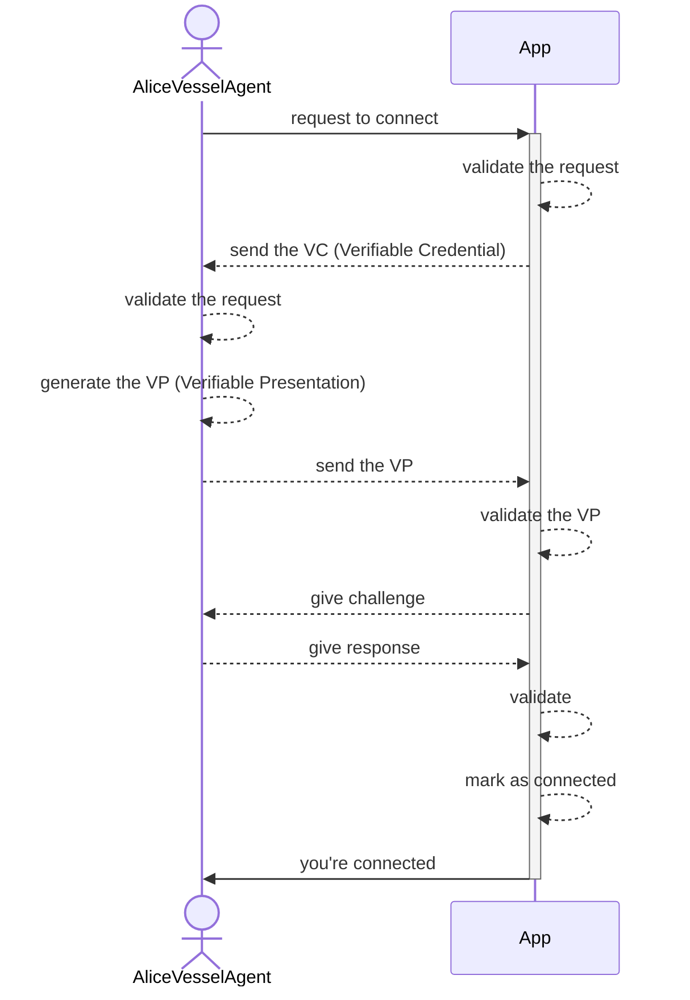

|   Paper   |   Section |   Version |   Author  |   CreatedAt   |
|   ------- |   ------- |   ------  |   ------  |   ---------   |
|   [The Prople Paper](https://github.com/prople/paper/tree/main/the-prople-paper/v1.0.0)   |   `Ecosystem` | v1.0.0 | [rstlix0x0](https://github.com/rstlix0x0/) |    July, 29th, 2024  03:15:00 UTC

# Table of Contents

- [Prople Platform](https://github.com/prople/paper/blob/main/the-prople-paper/v1.0.0/ecosystem.md#prople-platform) 
- [Prople Apps](https://github.com/prople/paper/blob/main/the-prople-paper/v1.0.0/ecosystem.md#prople-apps)
- [Prople Community](https://github.com/prople/paper/blob/main/the-prople-paper/v1.0.0/ecosystem.md#prople-community)
- [Prople OSS Center](https://github.com/prople/paper/blob/main/the-prople-paper/v1.0.0/ecosystem.md#prople-oss-open-source-software-center)

---

# Ecosystem

For now, the `Prople Ecosystem` will contains:

- `Prople Platform`
- `Prople Apps`
- `Prople Community`
- `Prople OSS Center`

## Prople Platform

`Prople Platform` provides two core components:

- `Prople Vessel`
- `Prople VSP Network`

`Prople Vessel` is a *single instance* of user's *vessel agent*. An user must setup their own *vessel agent* in some environments that able to reaches through the Internet. It can be a cloud environment, a bare metal server, or even in their *localhost* and connected through *ngrok*.

`Prople VSP Network` is an open, decentralized and P2P network. Anyone can join and participate to this network. An user also able to use this network, if they won't to setup their own *vessel agent*. This network provides same features of `Prople Vessel`, the difference is, user doesn't need to setup their own *vessel agent*, what they need are:

- Connect their *vessel controllers* or *vessel client* to this network
- Reserve their own *vessel agent* 

> There are will be a fee to use this network to reserve the *vessel agent*. This fee will be paid to the *vessel providers*

## Prople Apps

The `Prople Apps` is a place where developers and engineers contribute by building the application on top of the `Prople Platform`.

Developers and engineers are free to promote their application at the *community hub*. They're also allowed to gain profitability from their consumers.

There are no limitations of technology stacks to start building an application on top of our platform. They should be free to use any technology stacks they're like. There are no limitations of the technology, it means there are many possibilities of the applications:

- The desktop app
- The mobile app
- The custom network

The differences between the application built on top of the `Prople Platform` with the *common* Web2 applications are:

- It must not force their users to create an identity that will be *sealead* inside their applications 
- The connection between the application and their users must be through user's `Prople Vessel Agent`, either user use a single instance or through the `VSP Networks` 

The experience building the application on top of `Prople Platrom` is almost like the Web3 experience. If in Web3 has a concept of *wallet*, then there is a new concept of *vessel agent* in the `Prople`. The connection between the application and their users must be through user *vessel agent*, even their application must be run it's own *vessel* to be connected with their users.

The high-level diagram to show the connection flows:

Once users have been *connected* with the application, they're start to use the application's features.

## Prople Community

There are will be a *community hub* which has functionalities of:

- Platform's announcement
- Promote an application
- Events management
- Open disucssions

Anyone are free to join the this *community hub* and free to share and discuss their ideas. For now, the *community hub* will placed at the Github: https://github.com/orgs/prople/discussions 

## Prople OSS (Open Source Software) Center

The `OSS Center` is a *central hub* maintained by the *foundation* which provides:

- Core technology platform
- Tooling or any supported software

All the provided technologies (including software, tools or library) will always be in *open source licenses*. The supported licenses are:

- [AGPL v3.0](https://spdx.org/licenses/AGPL-3.0.html)
- [GPL v3.0 or later](https://spdx.github.io/license-list-data/GPL-3.0-or-later.html)
- [Apache License 2.0](https://spdx.org/licenses/Apache-2.0.html)
- [MIT License](https://spdx.org/licenses/MIT.html)

For the documentation and collaboration management:

- `Prople Paper`
- `Prople OSS RFC`
- `Prople OSS ADR (Architecture Decision Record)`

The main repository of the `Prople OSS Center`: https://github.com/prople

This repository will be used for all the software, library, sdk, including for its documentation (paper, rfc and adr)

---

> [The Prople Paper: Ecosystem](https://github.com/prople/paper/blob/main/the-prople-paper/v1.0.0/ecosystem.md) © 2024 by [rstlix0x0](https://github.com/rstlix0x0/) is licensed under [Creative Commons Attribution-ShareAlike 4.0 International](https://creativecommons.org/licenses/by-sa/4.0/?ref=chooser-v1) 
