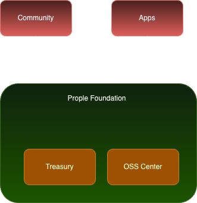

|   Paper   |   Section |   Version |   Author  |   CreatedAt   |
|   ------- |   ------- |   ------  |   ------  |   ---------   |
|   [The Prople Paper](https://github.com/prople/paper/tree/main/the-prople-paper/v1.0.0)   |   `Governance` | v1.0.0 | [rstlix0x0](https://github.com/rstlix0x0/) |    July, 30th, 2024  02.57:00 UTC

# Table of Contents

- [Treasury](https://github.com/prople/paper/blob/main/the-prople-paper/v1.0.0/governance.md#treasury)
- [OSS Center](https://github.com/prople/paper/blob/main/the-prople-paper/v1.0.0/governance.md#oss-center)

---

# Governance

There is a `Prople Foundation` as the *core foundation*. The high-level diagram visualize the relations:

The `Prople Foundation` will only maintains two core domains:

- `Treasury`
- `OSS (Open Source Software) Center`

The *community* and also the *apps* will be outside of the *foundation*, which means, the foundation should not put too many powers or influence to control them, and also to make sure for the *opennes* and rich growing community and *adoptability* of applications.

The `Prople Foundation` itself will be managed as *non-profit organizations* which provides the `OSS` and also it's `Treasury` to support the ecosystem.

## Treasury

This term taken from the `Web3 DAO` concepts. The *treasury* is a place where the *foundation* accept any donations from outside or external entities. The *treasury* can be managed with two ways:

- Fiat currency
- Crypto currency

> All the *treasury* deposits including for its expenses will always be reported *publicly*.

The treasury deposits will be used for the core development and the ecosystem needs. 

## OSS Center

`Prople Foundation` will provides the core technology *without* any supports for now except only for the papers and documentation, because for now there are still a lot of things that need to be done, so focus on the core development is important.

The `OSS Center` for now will only focus on these components:

- `Prople Vessel`
- `Prople VSP`

Including for any libraries, packages, and modules that will support those components.

Since the `Prople Foundation` is not like common startup or tech company, it's a *non profit organization*, anyone can be a *contributor*, but, to be a *maintainer* it will be chosen by the core team, and the one of conditions to be a *maintainer*, they should be a *contributor* first. The active, honest, and effective *contributor* will be recommended to join *maintainer* teams. 

> As a *maintainer*, they should be rewarded using the currency deposited at the *treasury*, to reward them for their time and resources help this project running.

*Maintainer* is not a technical person that will doing *coding*, but it may also be a person that willing to help maintains:

- Community
- Documentation
- Social media

---

> [The Prople Paper: Governance](https://github.com/prople/paper/blob/main/the-prople-paper/v1.0.0/governance.md) © 2024 by [rstlix0x0](https://github.com/rstlix0x0/) is licensed under [Creative Commons Attribution-ShareAlike 4.0 International](https://creativecommons.org/licenses/by-sa/4.0/?ref=chooser-v1) 
