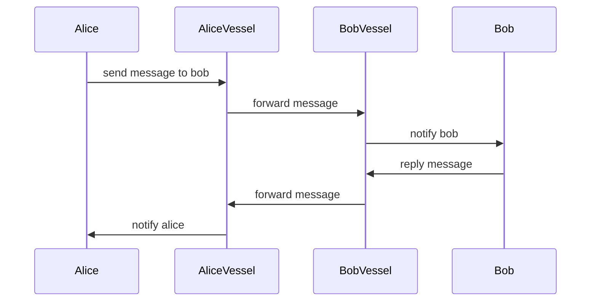
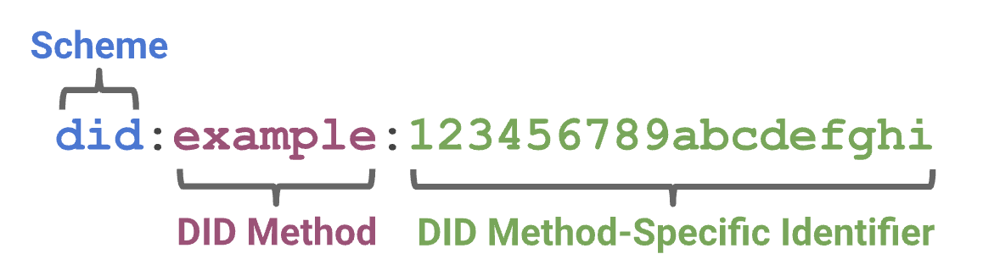
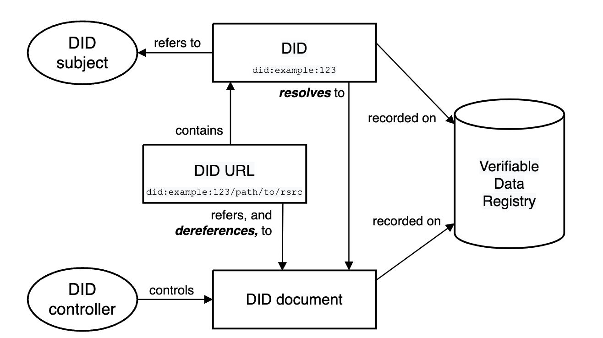
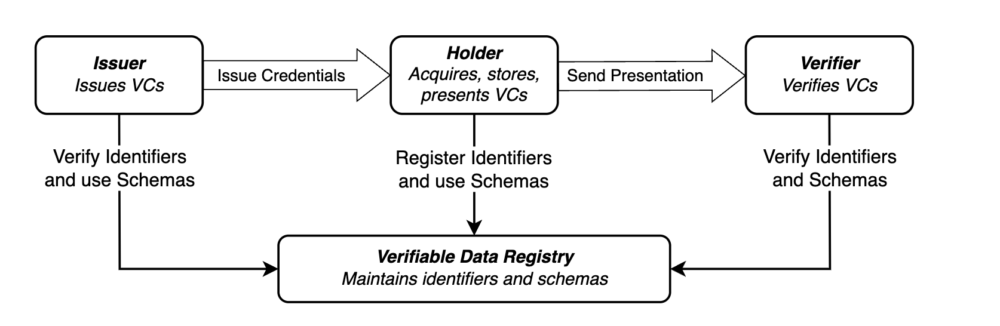
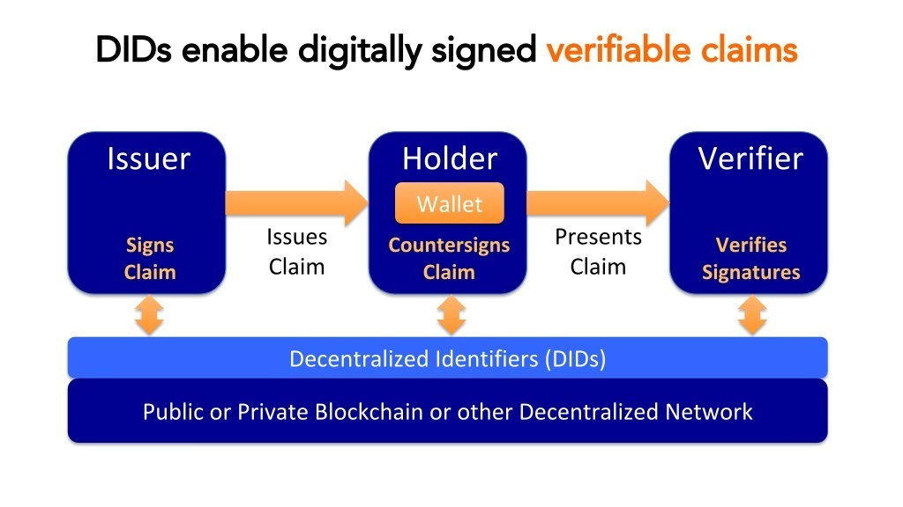
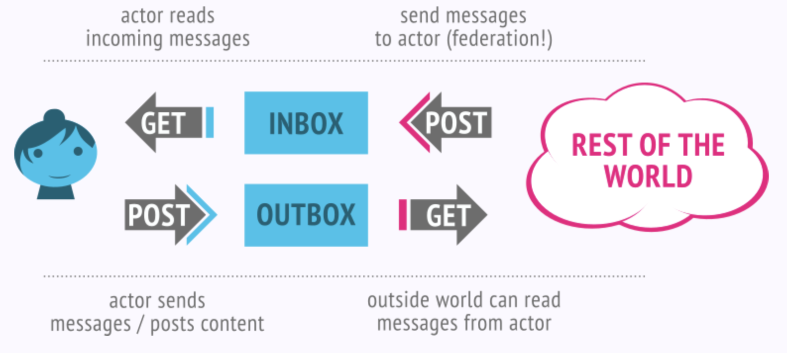

|   Paper   |   Section |   Version |   Author  |   CreatedAt   |
|   ------- |   ------- |   ------  |   ------  |   ---------   |
|   [The Prople Paper](https://github.com/prople/paper/tree/main/the-prople-paper/v1.0.0)   |   `Personalization Platform` | v1.0.0 | [rstlix0x0](https://github.com/rstlix0x0/) |    July, 22th, 2024  02:06:00 UTC

---

# The Personalization Platform

## Overview

There are evolutions in Web technologies, from the `Web1` to `Web3`. The evolution flows become like this:

```
Read -> Write -> Own
```

There are also movements about our digital behaviors: 

- From the *account balances* to *personal wallet* 
- From the secured digital organizations to the cryptographically secured 
- From the *username* to the *public key* or *public address*
- From the *password* to the *private key* or *seed phrase*
- From the *centralized social network* to the *decentralized social network*

`Prople` is about the `Personalization Platform`. Which an *actor*,  has a `true ownership` of their *assets*. They'll be able to maintain and manage their digital life activities.

### The Raise Of Cryptography

The *personalization movement* doesn't need to eliminate any organization or institutions. The difference is through this movement, an *actor* will host, own and manage their *identities* including for all their assets. There are still possibilities between organization / institution to working and integrated side by side with any *actors* without need to control or own the *actor identity* or *actor's assets*. One of key reasons behind the organization or institution must to host and control their user's identities and assets is because the *verification process*. By host their user's identities and assets, the organization or institution will able to *verify* any of their user's activities including for their assets.

Since the raise of `Bitcoin`, the first decentralized and P2P cryptocurrency network, and then `Ethereum` as the first *decentralized shared computation*, in the same time, it also the raise of cryptography.

> Cryptography is all about securing information and communication. It's like writing in a secret code that only authorized people can understand.

Through the cryptography algorithms, there are two important concepts:

- Encryption / Decryption
- Digital Signature

`Bitcoin` , `Ethereum`, `Solana`, `NEAR Protocol`, all of these blockchain networks depends on cryptography algorithms, especialy for the *asymmetric encryption*. Encryption is the core of cryptography techniques, including for the *digital signatures*. By using cryptography, we're able to verify the actor's identities and assets, through it's digital signatures, without need to host the actor's data in some organization or institution database vault. 

There are no need anymore, for any *actors* to create their *credential* like *username* and *password* to many organizations, what we need now is just to share the actor *public key*. Through this key, an organization or institution will be able to verify any *digital messages* including for the *digital assets* and *digital activities*.

The *message exchanges* between an *actor* and the *organization* also able to be encyrypted, it provides more secure communication channel between parties.

### The Raise Of Decentralized and P2P Networks

`Bitcoin` is not just the first *public permissionless* blockchain networks, it also proves that the important transactions like sending a *value* between two parties is able to be executed without any intermediaries or third-party entities. There are no *centralized entity* or *exclusive intermediaries*, it just the network which not controlled and owned by any single organizations, and even it's more secured than any *centralized entities*. 

In software engineering, there is term called as *SPOF (Single Point of Failure)*, it's a concept where there is a single part or component in the system that if this part / component fail, it will stop the entire system. That's the rist of *centralized entity*. The `Bitcoin`, `Ethereum` and other several public blockchain networks, all of them secured by *decentralized networks*. As long as there is a *node operator* stay alive, the network is alive.

> There are no *SPOF* in decentralized networks

Like what already been explained above that there are no *centralized organization* own the `Bitcoin`. If there are no organization or institution, how they manage their networks? It's _easy_ to say when we are building the *private / enterprise network* like `Microsoft`, `Google` or `Facebook` to maintain coordination, maintain the deployment. How to do all of that in the *decentralized networks* ? How to maintain coordination? And the most important thing is, how to maintain *trust*?

The answer is `peer-to-peer networks`. There are only *node operators* and *validators* existed in the `Bitcoin` networks or other public blockchain networks. Each of available *peer* communicate each others through some defined *communication protocol*, which is a set of rules that already been defined. All of these peers also *watch* each others, they'll *verify* all incoming transactions through some defined *consensus algorithms*. If a single *node* fails, there are still hundreds, or even thousands of them still available online, which running indepedently. Each of *peers* will also store the same data, it means, if there is a single *node* fail, the data is still available in the next hundreds or thousands other nodes. The data will be *distributed* and *replicated* to all available nodes.

### Prople: The Personalization Platforms

First thing first, `Prople` is not a *public blockchain networks*. `Prople` is about the *decentralized network*, the *platform* and the *ecosystem*, which designed specifically to give back freedom, control and *ownership* back to *actors*, whatever *actor* means, it can be an individual or person, an organization or institution, a device or even a *bot*.

`Prople` will provides an *ecosystem*, where an *actor* will able to integrate with an organization or institution in the *fair relationship*. If as a person, when we are join to some *social network*, they (the provider / organization), have rights to use our profiles and activities as the data and sell it to advertisers without notify us and _share_ nothing with us. They've got much money from our data, is it *fair*? 

Totally eliminate organizations or institutions also not the answer, the right answer is fix the connection between the organization or institution with the *actor*. The *ecosystem* in the `Prople`, designed to have this *good*, *healthy* and *fair* connection between both parties. An *actor*, like a person, still need the intermediaries or organization, and vice versa, but the connection and relation between both must be stand based on *fair relation* and *fair connection*. The *actor* own and manage their *identities*, their activities and assets, and the organization doesn't need to host their actor data on their vaults just for the verification, it can be done through cryptography algorithms. 

There is a software called `Prople Vessel`, which is a *container* or an *agent* used as *digital representation* of an *actor*. What *actor* need to do is to deploy this *agent* into their environment, a cloud or bare metal servers, and they'll be able to connected to their agents through a *controller* which is a desktop/web clients. This software (vessel), used to connected to other *actors*, it can be an user, an organization, or even a *bot*. 

> An *actor* may have multiple *vessels*, but a single *vessel* can only be owned by a single *actor*.

The message flows between users can be visualized like diagram below:



All the *communication* between *actors* will always goes through their *vessels*.

The `Prople Vessel` will have functionalities to manage these three domain problems:

- `DID (Decentralized Identity)`
- `Decentralized Social`
- `Decentralized Finance`

All of these three core domains designed specifically to help an *actor* to own and control their activities and assets, including their integration with some entities, organization or institution, inside the `Prople Ecosystem`.

## Core Domains

### Identity

*Identity* is the core foundation of `Prople`. The other domains will be build on top of this primary domain. There are already existed many *identity management solution* out there, including for the `OpenID`, which try to solve the *interoperability* problem. The problem that try to solve here is about the *ownership* and *self manage* identity management, which focus on *personalization identity platform*.

`Prople` not bring new solution or standards to solve these issues, but implement existed standards:

- `DID (Decentralized Identity)`
- `SSI (Self Sovereign Identity)`

#### DID (Decentralized Identity)

> Decentralized identifiers (DIDs) are a new type of identifier that enables verifiable, decentralized digital identity [^1]

The most interesting of this concept is this data model designed to be separated from any *centralized registries*. A `DID` syntax is an `URI` which associate a `DID Subject` with a `DID Document`, and the `DID Document` itself will contains a cryptographic materials.

`DID` format:



Example of `DID Document`:

```json
{
  "@context": [
    "https://www.w3.org/ns/did/v1",
    "https://w3id.org/security/suites/ed25519-2020/v1"
  ]
  "id": "did:example:123456789abcdefghi",
  "authentication": [{    
    "id": "did:example:123456789abcdefghi#keys-1",
    "type": "Ed25519VerificationKey2020",
    "controller": "did:example:123456789abcdefghi",
    "publicKeyMultibase": "zH3C2AVvLMv6gmMNam3uVAjZpfkcJCwDwnZn6z3wXmqPV"
  }]
}
```

The architecture overview of `DID`:



Components:

- `DID`: It's the main identifier which composed of three parts, the scheme `did`, *method identifier*, and a unique identifier  
- `DID Subject`: Every `DID` will always refer to an `DID Subject` which is an *entity* or *actor* identified by the `DID`, and it might also the `DID Controller`
- `DID Controller`: It's an *entity* or an *actor* that has capability to modify the `DID Document`
- `DID Document`: It contains an information associated with the `DID`. This document will contains any cryptographic public keys to express *verification method*
- `Verifiable Data Registry (VDR)`: To resolve the `DID Document`, the `DIDs` will be recorded in underlying system or network. Any system or vault which used to store the `DID Document` and the `DIDs`, will be called as `VDR`, regardless whatever the technology used 

To manage *credentials*, there is a concept called as `DID Verifiable Credential (DID VC)`, used to express *credentials* that is cryptographically secure, privacy respecting, and machine-verifiable.[^2] A *holder* of `VC` able to generate the `Verifiable Presentation (VP)`, and share this `VP` with the *verifiers* to prove the *credentials*.

The overview message flows:



An example of `VC` documents with embedded cryptographic proofs:

```json
{
  "@context": [
    "https://www.w3.org/ns/credentials/v2",
    "https://www.w3.org/ns/credentials/examples/v2"
  ],
  "id": "http://example.gov/credentials/3732",
  "type": ["VerifiableCredential", "ExampleDegreeCredential"],
  "issuer": "did:example:6fb1f712ebe12c27cc26eebfe11",
  "validFrom": "2010-01-01T19:23:24Z",
  "credentialSubject": {
    "id": "https://subject.example/subject/3921",
    "degree": {
      "type": "ExampleBachelorDegree",
      "name": "Bachelor of Science and Arts"
    }
  },
  "proof": {
    "type": "DataIntegrityProof",
    "cryptosuite": "eddsa-rdfc-2022",
    "created": "2021-11-13T18:19:39Z",
    "verificationMethod": "https://university.example/issuers/14#key-1",
    "proofPurpose": "assertionMethod",
    "proofValue": "z58DAdFfa9SkqZMVPxAQp...jQCrfFPP2oumHKtz"
  }
}
```

The `verificationMethod` defined above, will refer to the defined keys at `DID Document`. It means, to verify this `VC Document`, we need to solve the `DID` first to get the `DID Document` which contains a set of *public keys*. This *public key* used to verify the digital signature at `proofValue`.

#### SSI (Self Sovereign Identity)

> Self-sovereign identity (SSI) is an approach to digital identity that gives individuals control over the information they use to prove who they are to websites, services, and applications across the web.[^3]

The overview architecture to enable individuals own and control their identities:



The `SSI` is the higher concept on top of `DID`. The `DID` itself is a low level implementation of the *sovereign identity*.

### Social

#### ActivityPub

The main objective of *social activities* defined in `Prople` ecosystem is about the *decentralized social network*. Instead of building the new algorithm or new protocols, `Prople` will implement current existed standard, called as `ActivityPub`. 

> Enter ActivityPub! ActivityPub is a decentralized social networking protocol based on the ActivityStreams 2.0 data format.[^4]



This standard protocol for the *decentralized social network* is aligned with the `Prople` vision that *actors* should have a freedom and rights to control their social activities, and this standard looks like able to reaches the objective.

This standard also already been recommended by the `W3C`:

> The ActivityPub protocol is a decentralized social networking protocol based upon the [ActivityStreams] 2.0 data format. It provides a client to server API for creating, updating and deleting content, as well as a federated server to server API for delivering notifications and content.[^5]

#### Matrix Protocol

> An open network for secure, decentralised communication.[^6]

To enable the real-time messaging communication, `Prople` also will implement this standard protocol, especially for its `Client-Server API`.

> The client-server API allows clients to send messages, control rooms and synchronise conversation history. It is designed to support both lightweight clients which store no state and lazy-load data from the server as required - as well as heavyweight clients which maintain a full local persistent copy of server state.[^7]

Data flows architecture:[^8]

```
 { Matrix client A }                             { Matrix client B }
        ^          |                                    ^          |
        |  events  |  Client-Server API                 |  events  |
        |          V                                    |          V
    +------------------+                            +------------------+
    |                  |---------( HTTPS )--------->|                  |
    |   homeserver     |                            |   homeserver     |
    |                  |<--------( HTTPS )----------|                  |
    +------------------+      Server-Server API     +------------------+
                          History Synchronisation
                              (Federation)
```

### Finance

#### Public Blockchain Network

`Prople` will integrated with some of cryptocurrency networks, and for the base network or as the foundation it will be integrated with the `NEAR Protocol`. Because there are so many networks out there, the main concerns to be take here is about the *chain abstraction* and *interoperability*, and because of these two things, `NEAR` chosen, rather than other networks. 

Next implementation will probable to support other networks, through some *abstraction* projects, such as:

- `Zetachain`
- `Axellar Network`

Although that the base foundation network will using `NEAR`, it doesn't mean to limit user's transactions. The main objective of *chain abstraction* is about user should be able to send their asset to any networks out there, _easily_.

#### Sovereign Crypto Wallet

As like common cryptocurrency networks, `Prople Vessel` also will be a *sovereign wallet* which means will maintain the *actor* keypairs which contain the *public* and *private* keys, secured with the `SSS (Shamir Secret Sharing)` algorithm. 

The definition of this wallet is not like a common web3 wallet which also used to connect to some *dapps*. The first implementation of the *wallet* will only to manage the *actor* keypairs and also monitor the on-chain transactions.

[^1]: https://www.w3.org/TR/did-core/
[^2]: https://www.w3.org/TR/vc-data-model-2.0/
[^3]: https://en.wikipedia.org/wiki/Self-sovereign_identity
[^4]: https://activitypub.rocks/
[^5]: https://www.w3.org/TR/2018/REC-activitypub-20180123/
[^6]: https://matrix.org/
[^7]: https://spec.matrix.org/v1.11/client-server-api/
[^8]: https://spec.matrix.org/v1.11/#architecture

---

> [The Prople Paper: Personalization Platform](https://github.com/prople/paper/blob/main/the-prople-paper/v1.0.0/personalization.md) © 2024 by [rstlix0x0](https://github.com/rstlix0x0/) is licensed under [Creative Commons Attribution-ShareAlike 4.0 International](https://creativecommons.org/licenses/by-sa/4.0/?ref=chooser-v1) 
