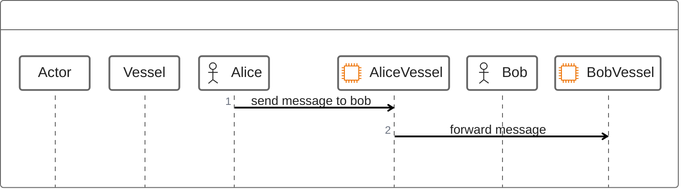

|   Paper   |   Section |   Version |   Author  |   CreatedAt   |
|   ------- |   ------- |   ------  |   ------  |   ---------   |
|   [The Prople Paper](https://github.com/prople/paper/tree/main/the-prople-paper/v1.0.0)   |   `Personalization Platform` | v1.0.0 | [rstlix0x0](https://github.com/rstlix0x0/) |    July, 22th, 2024  02:06:00 UTC

---

# The Personalization Platform

## Overview

There are evolutions in Web technologies, from the `Web1` to `Web3`. The evolution flows become like this:

```
Read -> Write -> Own
```

There are also movements about our digital behaviors: 

- From the *account balances* to *personal wallet* 
- From the secured digital organizations to the cryptographically secured 
- From the *username* to the *public key* or *public address*
- From the *password* to the *private key* or *seed phrase*
- From the *centralized social network* to the *decentralized social network*

`Prople` is about the `Personalization Platform`. Which an *actor*,  has a `true ownership` of their *assets*. They'll be able to maintain and manage their digital life activities.

### The Raise Of Cryptography

The *personalization movement* doesn't need to eliminate any organization or institutions. The difference is through this movement, an *actor* will host, own and manage their *identities* including for all their assets. There are still possibilities between organization / institution to working and integrated side by side with any *actors* without need to control or own the *actor identity* or *actor's assets*. One of key reasons behind the organization or institution must to host and control their user's identities and assets is because the *verification process*. By host their user's identities and assets, the organization or institution will able to *verify* any of their user's activities including for their assets.

Since the raise of `Bitcoin`, the first decentralized and P2P cryptocurrency network, and then `Ethereum` as the first *decentralized shared computation*, in the same time, it also the raise of cryptography.

> Cryptography is all about securing information and communication. It's like writing in a secret code that only authorized people can understand.

Through the cryptography algorithms, there are two important concepts:

- Encryption / Decryption
- Digital Signature

`Bitcoin` , `Ethereum`, `Solana`, `NEAR Protocol`, all of these blockchain networks depends on cryptography algorithms, especialy for the *asymmetric encryption*. Encryption is the core of cryptography techniques, including for the *digital signatures*. By using cryptography, we're able to verify the actor's identities and assets, through it's digital signatures, without need to host the actor's data in some organization or institution database vault. 

There are no need anymore, for any *actors* to create their *credential* like *username* and *password* to many organizations, what we need now is just to share the actor *public key*. Through this key, an organization or institution will be able to verify any *digital messages* including for the *digital assets* and *digital activities*.

The *message exchanges* between an *actor* and the *organization* also able to be encyrypted, it provides more secure communication channel between parties.

### The Raise Of Decentralized and P2P Networks

`Bitcoin` is not just the first *public permissionless* blockchain networks, it also proves that the important transactions like sending a *value* between two parties is able to be executed without any intermediaries or third-party entities. There are no *centralized entity* or *exclusive intermediaries*, it just the network which not controlled and owned by any single organizations, and even it's more secured than any *centralized entities*. 

In software engineering, there is term called as *SPOF (Single Point of Failure)*, it's a concept where there is a single part or component in the system that if this part / component fail, it will stop the entire system. That's the rist of *centralized entity*. The `Bitcoin`, `Ethereum` and other several public blockchain networks, all of them secured by *decentralized networks*. As long as there is a *node operator* stay alive, the network is alive.

> There are no *SPOF* in decentralized networks

Like what already been explained above that there are no *centralized organization* own the `Bitcoin`. If there are no organization or institution, how they manage their networks? It's _easy_ to say when we are building the *private / enterprise network* like `Microsoft`, `Google` or `Facebook` to maintain coordination, maintain the deployment. How to do all of that in the *decentralized networks* ? How to maintain coordination? And the most important thing is, how to maintain *trust*?

The answer is `peer-to-peer networks`. There are only *node operators* and *validators* existed in the `Bitcoin` networks or other public blockchain networks. Each of available *peer* communicate each others through some defined *communication protocol*, which is a set of rules that already been defined. All of these peers also *watch* each others, they'll *verify* all incoming transactions through some defined *consensus algorithms*. If a single *node* fails, there are still hundreds, or even thousands of them still available online, which running indepedently. Each of *peers* will also store the same data, it means, if there is a single *node* fail, the data is still available in the next hundreds or thousands other nodes. The data will be *distributed* and *replicated* to all available nodes.

### Prople: The Personalization Platforms

First thing first, `Prople` is not about a *public blockchain networks*. `Prople` is about the *decentralized network*, the *platform* and the *ecosystem*, which designed specifically to give back freedom, control and *ownership* back to *actors*, whatever *actor* means, it can be an individual or person, an organization or institution, a device or even a *bot*.

`Prople` will provides an *ecosystem*, where an *actor* will able to integrate with an organization or institution in the *fair relationship*. If as a person, when we are join to some *social network*, they (the provider / organization), will have rights to use our profiles and activities as the data and sell it to their advertisers without notify us and _share_ nothing with us. They've got much money from our data, is it *fair*? Totally eliminate organizations or institutions also not the answer, the right answer is fix the connection between the organization or institution with the *actor*. The *ecosystem* in the `Prople`, designed to have this *good*, *healthy* and *fair* connection between both parties. An *actor*, like a person, still need the intermediaries or organization, and vice versa, but the connection and relation between both must be stand based on *fair relation* and *fair connection*. The *actor* own and manage their *identities*, their activities and assets, and the organization doesn't need to host their actor data on their vaults just for the verification, it can be done through cryptography algorithm. 

There is a software called `Prople Vessel`, which is a *container* or an *agent* used as *digital representative* of an *actor*. What *actor* need to do is to deploy this *agent* into their environment, a cloud or bare metal servers, and they'll be able to connected to their agents through a *controller* which is a desktop/web clients. This software (vessel), used to connected to other *actors*, it can be an user, an organization, or even a *bot*. 

> An *actor* may have multiple *vessels*, but a single *vessel* can only be owned by a single *actor*. 



---

> [The Prople Paper: Personalization Platform](https://github.com/prople/paper/blob/main/the-prople-paper/v1.0.0/personalization.md) © 2024 by [rstlix0x0](https://github.com/rstlix0x0/) is licensed under [Creative Commons Attribution-ShareAlike 4.0 International](https://creativecommons.org/licenses/by-sa/4.0/?ref=chooser-v1) 
